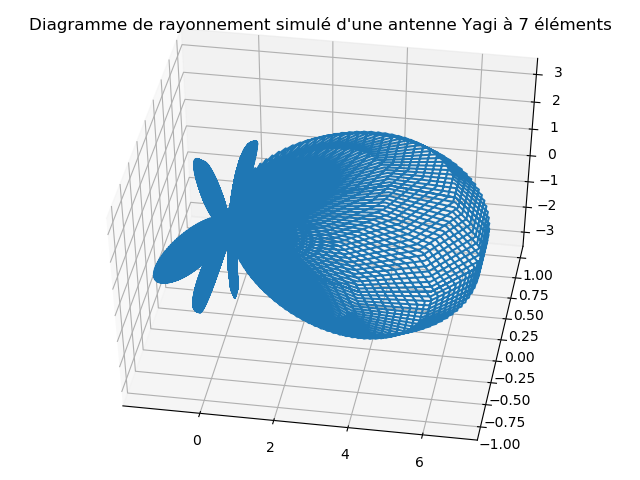
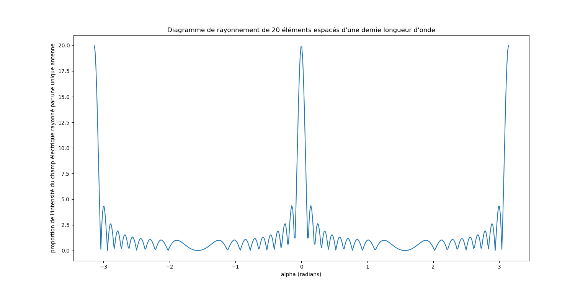
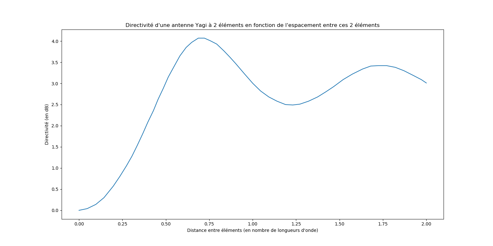
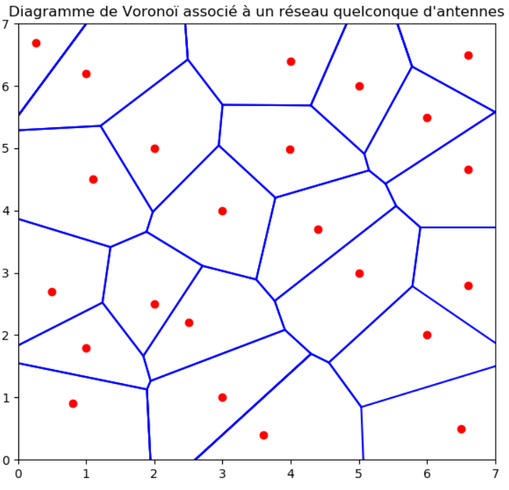
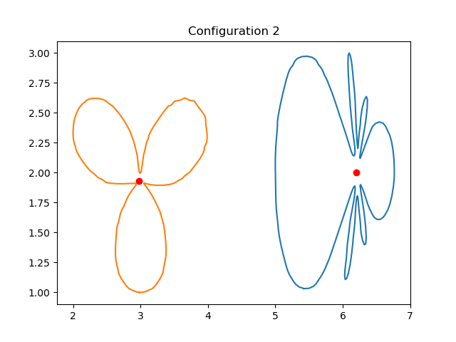
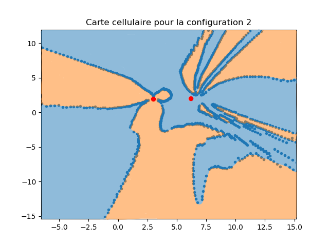
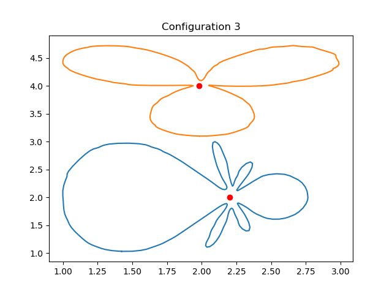
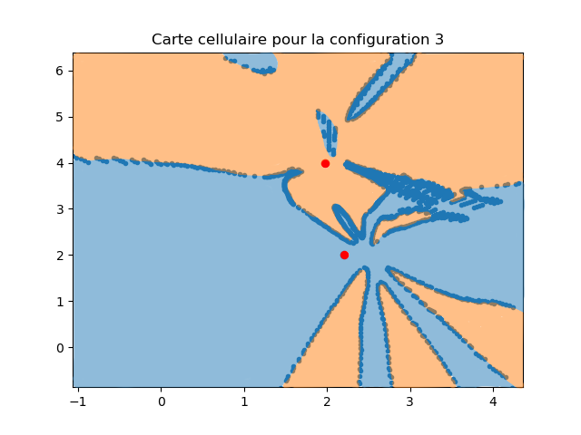

# Antenna-networks

How to optimize the layout of antennas within complex telecommunication networks: a brief study. This repo contains the single-file python script I used to support this study, along with some documentation.

This work was done for the entrance exams of engineering schools (TIPE). The script mainly produces figures that I used during the presentation of my work.

<strong>Note: This script was only made to illustrate physics studies. The emphasis was not on the code itself. The quality of the script is mediocre from a software engineering standpoint, as I lacked computer science and programming skills at the time (I was majoring in Mathematics and Physics).
The purpose of this repo is rather to showcase the main points of my study, and how I used this script I made to support it.</strong>

# Content

The script is <code>script.py</code>.

The /Presentation/ directory contains an abstract and the presentation slides (both in french for the most part).

The /Illustrations/ directory contains images I used to support the presentation. Most of them are figures generated by the script. I present some of them in this README.

The different parts of the study are briefly explained below. Those explanations can be supplemented by the following elements:

<ul>
    <li>The abstract of the study that can be found under the /Presentation/ folder.</li>
    <li>The slides of the presentation available in the /Presentation/ folder as well.</li>
    <li>The extensive comments in the script's code (in french).</li>
    <li>Images within the /Illustrations/ folder.</li>
</ul>

# Part 1: Skywaves

In radio communications, skywaves refer to electromagnetic waves that are refracted and reflected back to Earth by the ionosphere. This deflection is due to the fact that the ionosphere is electrically charged. The electron density within this layer of the atmosphere varies with altitude, as shown in the following figure:

<figure>
    
    <figcaption>Figure 1: Electron density with respect to altitude within the ionosphere</figcaption>
</figure>   

Skywaves can be particularly useful for long-distance communications as they can reach points beyond the horizon as defined at the location of their emission. They are mainly used in the shortwave frequency band.

We want to compute the paths of skywaves within the ionosphere depending on their angle of emission, and frequency for the most part. Using this data, we can then place antennas accordingly for specific long-distance communication needs.

Using reasonable approximations, we can shift the problem into the field of geometrical optics. As the electron density varies within the ionosphere, so does the refractive index of the air. This can be visualized on the following figure:

<figure>
    
    <figcaption>Figure 2: Refractive index of the air with respect to altitude within the ionosphere</figcaption>
</figure>   

The script subdivides the ionosphere into multiple layers of fixed refractive index, throws an electromagnetic ray (can be thought as the wave's Poynting vector) of an adjustable frequency from ground level to the ionosphere with an adjustable angle of incidence. The trajectory of the ray is defined using Snell's law each time the ray passes from one subdivision of the ionosphere to the next.

Using this method, we can retrieve approximated trajectories like the following (the horizontal axis represents the horizontal distance to the emission point; the vertical axis represents the vertical distance to the emission point).

<figure>
    
    <figcaption>Figure 3: Reflected skywave</figcaption>
</figure>   

<figure>
    
    <figcaption>Figure 4: Skywave is not reflected back to Earth</figcaption>
</figure>  

# Part 2: Design considerations for antennas

In this part, I focused on design considerations of antennas. The goal was to compute radiation patterns, directivity, and more, for complex antenna designs. Parameters such as the number of active and passive elements of an antenna, their sizes and location, the presence of reflectors or not (etc...) were taken into account.

The data provided by this part can help selecting the right antenna designs for specific telecommunication networks.

The script helps plotting radiation patterns (in specific planes or in global space), and compute directivity graphs as shown below:

<figure>
    
    <figcaption>Figure 5: Part of the radiation pattern of a 7-element Yagi-Uda antenna plotted with the script</figcaption>
</figure>   

<figure>
    
    <figcaption>Figure 6: Radiation pattern of a 20-element Yagi-Uda antenna plotted with the script</figcaption>
</figure>   

<figure>
    
    <figcaption>Figure 7: Directivity of a 2-element Yagi-Uda antenna with respect to the distance between those elements</figcaption>
</figure>   

You can have a look at the slides of the presentation for greater details on the calculations.

# Part 3: Antenna layout in cellular networks

This part focuses on cellular networks. The main questions I used for this part were the following:

<ul>
    <li>What is the best way to organize the layout of antennas inside a cellular network depending on their designs?</li>
    <li>Given a fixed layout of antennas, which antenna should a receiver connect to (the power of the signal was the main criterion used)?</li>
</ul>

In a first approach, I simply considered that a receiver should connnect to the closest (with regard to the euclidean distance) antenna in the network. This does not take the design of the antennas into account: the antennas are considered isotropic.

The problem could thus be rephrased like so: given a set of seed points (the antennas) in a plane, find the tessellation that subdivides the plane into regions, where each region contains only one seed point (the region's seed point), and all points in a region are closer to the region's seed point than to any other seed point on the plane.
The solution to this problem consists in computing the <a href="https://en.wikipedia.org/wiki/Voronoi_diagram">Voronoi diagram</a> associated with the set of seed points representing the antennas of the cellular network.

To do so, I implemented <a href="https://en.wikipedia.org/wiki/Fortune%27s_algorithm">Fortune's algorithm</a> in the script. Detailed explanations of the different parts of the algorithm can be found in the comments of the script code.

Here is an example of a Voronoi diagram computed by the script and respresenting the different areas of influence of antennas (the seed points in red):

<figure>
    
    <figcaption>Figure 8: Cellular map of a network based on a Voronoi tessellation</figcaption>
</figure>   

The next step was to produce cellular maps that take into account the radiation patterns of the antennas used within the network. I could thus reuse some elements of part 2.

<strong>Note: The part of the script that is responsible for computing and plotting such maps uses OpenCV.</strong>

As the algorithm I designed to compute those maps is computationally expensive, I could only test it for small networks comprised of 2 antennas with different radiation patterns.

The first antenna I chose is a Yagi-Uda antenna whose radiation pattern is represented by a blue line in the layout figures shown below. In the cellular maps, blue areas receive a greater power from this Yagi-Uda antenna than from the other antenna.

The second antenna has a 3-beam radiation pattern represented by a red line in the layout figures shown below. In the cellular maps, red areas receive a greater power from this antenna than from the Yagi-Uda.

Here are some results given by the script:

<figure>
    
    <figcaption>Figure 9: First test layout for the antennas</figcaption>
</figure>   

<figure>
    
    <figcaption>Figure 10: Cellular map for the first test layout</figcaption>
</figure>   

<figure>
    
    <figcaption>Figure 11: Second test layout for the antennas</figcaption>
</figure>   

<figure>
    
    <figcaption>Figure 12: Cellular map for the second test layout</figcaption>
</figure>   
