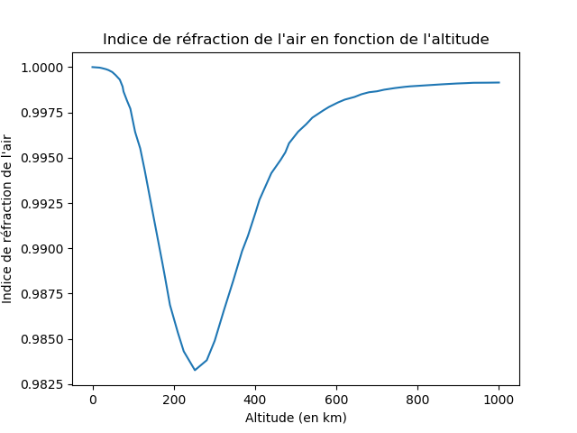

# Antenna-networks

How to optimize the layout of antennas within complex telecommunication networks: a brief study. This repo contains the single-file python script I used to support this study, along with some documentation.

This work was done for the entrance exams of engineering schools (TIPE). The script mainly produces figures that I used during the presentation of my work.

<strong>Note: This script was only made to illustrate physics studies. The emphasis was not on the code itself. The quality of the script is mediocre from a software engineering standpoint, as I lacked computer science and programming skills at the time (I was majoring in Mathematics and Physics).
The purpose of this repo is rather to showcase the main points of my study, and how I used this script I made to support it.</strong>

# Content

The script is <code>script.py</code>.

The /Presentation/ directory contains an abstract and the presentation slides (both in french for the most part).

The /Illustrations/ directory contains images I used to support the presentation. Most of them are figures generated by the script. I present some of them in this README.

# Part 1: Skywaves

In radio communications, skywaves refer to electromagnetic waves that are reflected or refracted back to Earth by the ionosphere. This deflection is due to the fact that the ionosphere is electrically charged. The electron density within this layer of the atmosphere varies with altitude, as shown in the following figure:

<figure>
    
    <figcaption>Figure 1: Electron density with respect to altitude within the ionosphere</figcaption>
</figure>

Skywaves can be particularly useful for long-distance communications as they can reach points beyond the horizon as defined at the location of their emission. They are mainly used in the shortwave frequency band.

We want to compute the paths of skywaves within the ionosphere depending on their angle of emission, and frequency for the most part. Using this data, we can then place antennas accordingly for specific long-distance communication needs.

Using reasonable approximations, we can shift the problem into the field of geometrical optics. As the electron density varies within the ionosphere, so does the refractive index of the air. This can be visualized on the following figure:

<figure>
    
    <figcaption>Figure 2: Refractive index of the air with respect to altitude within the ionosphere</figcaption>
</figure>

The script subdivides the ionosphere into multiple layers of fixed refractive index, throws an electromagnetic ray (can be thought as the wave's Poynting vector) of an adjustable frequency from ground level to the ionosphere with an adjustable angle of incidence. The trajectory of the ray is defined using Snell's law each time the ray passes from one subdivision of the ionosphere to the next.

Using this method, we can retrieve approximated trajectories like the following (the horizontal axis represents horizontal distance from emission point; the vertical axis represents vertical disatnce from emission point).

<figure>
    
    <figcaption>Figure 3: Reflected skywave</figcaption>
</figure>

<figure>
    
    <figcaption>Figure 4: Skywave is not reflected back to Earth</figcaption>
</figure>

